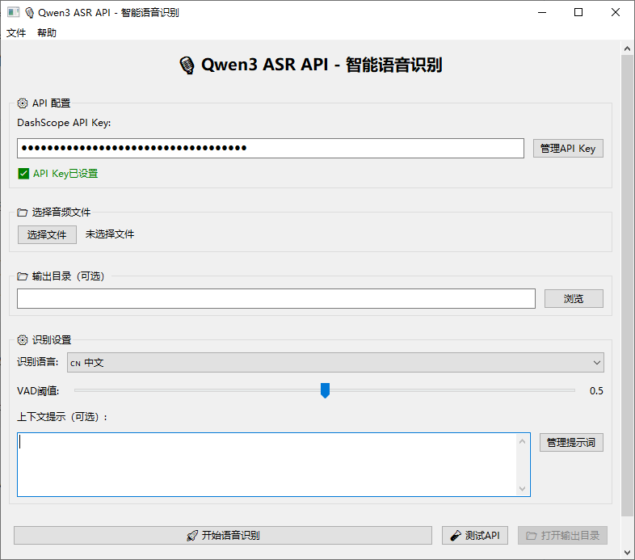

<div align="center">
  

  # 声稿师 Voicer - 长音视频语音识别系统

  一个基于阿里云通义千问3 ASR Flash模型的长音视频语音识别系统，支持超过3分钟音频的智能分段识别和上下文管理，并提供GUI界面。
</div>

## ✨ 特性

- 由于Qwen3-ASR-Flash模型API的限制(文件小于10MB，时长小于3分钟)，本项目基于Silero进行语音活动检测(VAD)和分割，将长音频分割为多个小于3分钟的片段，然后调用Qwen3-ASR-Flash识别，前面的音频识别结果作为后面识别的上下文，如此保证识别长音视频的连贯性。
- 支持常见音视频格式的输入，包括但不限于MP3、WAV、M4A、FLAC、MP4、AVI、MOV等。

## 🚀 快速开始

### 环境要求

- Python 3.11+
- FFmpeg（用于音频转换）
- 阿里云DashScope API Key

### GUI 界面（wxPython）

项目提供 wxPython 图形界面：



```bash
# 启动 GUI（推荐用 uv）
uv run python run_gui.py

# 或使用模块方式
uv run python -m src.gui_wx.app

```


### 安装

1. **克隆项目**
```bash
git clone <repository-url>
```

2. **安装依赖**
```bash
# 使用uv（推荐）
uv sync
```

3. **依赖自动下载**
- 首次启动时会自动下载 Silero VAD 模型到 external/silero_vad/
- ffmpeg 优先使用系统 PATH；若未安装，可设置环境变量 FFMPEG_ZIP_URL 为“包含 ffmpeg.exe 和 ffprobe.exe 的 ZIP 包”的直链，脚本会自动下载并解压到 external/ffmpeg/

设置方式（临时生效，推荐在命令行中使用）：

- Windows PowerShell
```powershell
$env:FFMPEG_ZIP_URL="https://example.com/ffmpeg.zip"; uv run python -m scripts.download_external
```

- Windows CMD
```bat
set FFMPEG_ZIP_URL=https://example.com/ffmpeg.zip && uv run python -m scripts.download_external
```

- macOS/Linux Bash
```bash
export FFMPEG_ZIP_URL=https://example.com/ffmpeg.zip && uv run python -m scripts.download_external
```

或者直接执行（若已安装 ffmpeg 并在 PATH 中，无需设置该变量）：
```bash
uv run python -m scripts.download_external
```


## 🛠️ 故障排除

### 常见问题

1. **FFmpeg未找到**
   ```bash
   # Windows (使用Chocolatey)
   choco install ffmpeg

   # macOS (使用Homebrew)
   brew install ffmpeg

   # Linux (Ubuntu/Debian)
   sudo apt install ffmpeg
   ```

## 📄 许可证

本项目采用 MIT 许可证 - 详见 [LICENSE](LICENSE) 文件

## 🤝 贡献

欢迎提交Issue和Pull Request！

## 📞 支持

如果您遇到问题或有建议，请：

- 提交 [Issue](../../issues)

## 🙏 致谢

- [阿里云通义千问](https://dashscope.aliyun.com/) - 提供ASR API服务
- [Silero VAD](https://github.com/snakers4/silero-vad) - 语音活动检测模型
- [FFmpeg](https://ffmpeg.org/) - 音频处理工具

---

**注意**：使用本系统需要阿里云DashScope API Key，请确保遵守相关服务条款和使用限制。