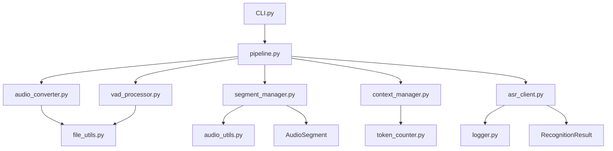

# 长音视频识别系统架构设计

## 1. 系统概述

本系统实现长音视频的自动语音识别（ASR），通过音频格式转换、语音活动检测（VAD）分割、分批识别和结果拼接，完成超过3分钟、10MB的长音频识别任务。

### 核心流程
1. **音频预处理**：任意格式 → Opus格式转换
2. **智能分割**：使用Silero-VAD进行语音活动检测和分割
3. **片段组合**：将分割后的音频组合成<3分钟的片段
4. **分批识别**：调用Qwen3-ASR-Flash模型进行识别
5. **上下文管理**：动态管理提示词长度，保持识别连贯性
6. **结果输出**：生成完整的识别文本文件

## 2. 简化后的文件结构

```
Qwen3_ASR_API/
├── src/                           # 源代码目录
│   ├── core/                      # 核心业务逻辑（6个模块）
│   │   ├── __init__.py
│   │   ├── audio_converter.py     # 音频格式转换
│   │   ├── vad_processor.py       # VAD语音活动检测与分割
│   │   ├── segment_manager.py     # 音频片段管理与组合
│   │   ├── asr_client.py          # ASR API调用客户端
│   │   ├── context_manager.py     # 上下文与提示词管理
│   │   └── pipeline.py            # 主流程编排
│   ├── utils/                     # 工具函数（5个模块）
│   │   ├── __init__.py
│   │   ├── file_utils.py          # 文件操作工具
│   │   ├── audio_utils.py         # 音频处理工具
│   │   ├── token_counter.py       # Token计数器
│   │   └── logger.py              # 日志工具
│   ├── config/                    # 配置管理（3个模块）
│   │   ├── __init__.py
│   │   ├── settings.py            # 系统配置
│   │   ├── cli_parser.py          # CLI参数解析
│   │   └── prompts.py             # 提示词模板
│   └── models/                    # 数据模型（3个模块）
       ├── __init__.py
       ├── audio_segment.py       # 音频片段数据模型
       ├── recognition_result.py  # 识别结果数据模型
       └── vad_segment.py         # VAD时间段数据模型
├── data/                          # 数据目录
│   ├── input/                     # 输入音频文件
│   └── output/                    # 输出结果（CLI 未指定时默认写到音/视频同目录）
├── [系统临时目录]/qwen3_asr_api/  # 运行期临时文件（自动创建，可清理）
│   ├── converted/                 # 转换后的 opus 临时文件
│   └── combined/                  # 组合后的片段临时文件
├── external/                      # 外部依赖
│   ├── ffmpeg/                    # FFmpeg可执行文件
│   └── silero_vad/                # Silero VAD模型文件
├── tests/                         # 测试文件（7个核心测试）
│   ├── __init__.py
│   ├── test_pipeline.py
│   ├── test_asr_client.py
│   ├── test_audio_converter.py
│   ├── test_vad_processor.py
│   ├── test_segment_manager.py
│   ├── test_context_manager.py
│   └── test_end_to_end.py
├── scripts/                       # 脚本文件
│   └── download_external.py
├── CLI.py                         # 主程序入口
├── requirements.txt               # 依赖列表
├── pyproject.toml                 # 项目配置
├── config.json                    # 配置文件
├── README.md                      # 项目说明
└── .env.example                   # 环境变量示例
```

## 3. 核心组件说明

### 3.1 音频转换模块 (audio_converter.py)
**职责**：将任意格式的音视频文件转换为Opus格式
- 使用FFmpeg进行格式转换
- 输出统一的Opus格式音频
- 简化的转换逻辑

### 3.2 VAD处理模块 (vad_processor.py)
**职责**：使用Silero-VAD进行语音活动检测和分割
- 检测音频中的语音活动区间
- 按照语音活动进行分割
- 输出时间戳和音频片段
- 整合了原vad_loader功能

### 3.3 片段管理模块 (segment_manager.py)
**职责**：管理音频片段的组合
- 将小片段组合成<3分钟的大片段
- 确保每个片段<10MB
- 简化的片段管理逻辑
- 移除了复杂的队列和状态管理

### 3.4 ASR客户端模块 (asr_client.py)
**职责**：调用Qwen3-ASR-Flash API进行语音识别
- 简化的API调用逻辑
- 基本的重试机制
- 解析返回结果
- 移除了复杂的异常类层次

### 3.5 上下文管理模块 (context_manager.py)
**职责**：管理提示词和上下文信息
- 维护场景描述
- 管理前文上下文
- 动态调整提示词长度（保持<9000 tokens）
- 整合了原context_concatenator、context_length_controller、smart_truncator功能

### 3.6 流程编排模块 (pipeline.py)
**职责**：协调整个识别流程
- 串联所有处理步骤
- 简化的流程控制
- 基本的错误处理
- 移除了复杂的状态管理和断点续传

## 4. 数据模型

### 4.1 AudioSegment (音频片段)
```python
@dataclass
class AudioSegment:
    id: str                    # 片段唯一标识
    file_path: str            # 文件路径
    start_time: float         # 开始时间(秒)
    end_time: float           # 结束时间(秒)
    duration: float           # 持续时间(秒)
    file_size: int            # 文件大小(字节)
    is_speech: bool           # 是否包含语音
    combined_group_id: str    # 组合后的大片段ID
```

### 4.2 RecognitionResult (识别结果)
```python
@dataclass
class RecognitionResult:
    segment_id: str           # 对应片段ID
    text: str                 # 识别文本
    confidence: float         # 置信度
    tokens_used: int          # 使用的token数
    request_id: str           # API请求ID
    timestamp: datetime       # 处理时间
```

### 4.3 VADSegment (VAD时间段)
```python
@dataclass
class VADSegment:
    start_time: float         # 开始时间（秒）
    end_time: float          # 结束时间（秒）
    is_speech: bool          # 是否为语音段
    confidence: float        # 置信度

@dataclass 
class VADResult:
    audio_file: str          # 原始音频文件路径
    segments: List[VADSegment]  # 检测到的时间段列表
    total_duration: float    # 音频总时长
```

## 5. 配置系统

### 5.1 核心配置 (settings.py)
配置系统支持多种加载方式，包括环境变量、配置文件等，具有完整的路径管理和验证功能。

```python
class Settings:
    # API配置
    DASHSCOPE_API_KEY: str
    ASR_MODEL: str = "qwen3-asr-flash"
    
    # 处理参数
    MAX_SEGMENT_DURATION: int = 180  # 3分钟
    MAX_SEGMENT_SIZE: int = 10 * 1024 * 1024  # 10MB
    MAX_CONTEXT_TOKENS: int = 9000
    
    # VAD参数
    VAD_THRESHOLD: float = 0.5
    MIN_SILENCE_DURATION: float = 0.5
    
    # ASR配置
    LANGUAGE: str = "zh"
    ENABLE_LID: bool = False
    ENABLE_ITN: bool = False
    
    # 路径配置（自动设置）
    PROJECT_ROOT: Path
    DATA_DIR: Path
    # ... 完整的路径配置系统
    
    # 配置加载方法
    def _load_from_env(self): ...
    def _load_from_config(self): ...
    def ensure_directories(self): ...
```

## 6. 模块间调用关系



## 7. 数据流转

1. **输入音频** → audio_converter → **Opus文件**
2. **Opus文件** → vad_processor → **音频片段列表**
3. **音频片段列表** → segment_manager → **组合片段列表**
4. **组合片段** + **上下文** → asr_client → **识别结果**
5. **识别结果** → context_manager → **更新上下文**
6. **所有结果** → pipeline → **最终文本文件**

## 8. 外部服务集成

- **FFmpeg**：通过子进程调用，用于音频转换
- **Silero-VAD**：通过ONNX Runtime调用，用于语音检测
- **Qwen3-ASR-Flash**：通过DashScope API调用，用于语音识别

## 9. 简化的错误处理

### 9.1 异常类型
- **基本异常**：使用简单的异常类，避免复杂的异常层次
- **网络异常**：API调用失败，简单重试
- **文件异常**：文件损坏或不存在，记录并跳过

### 9.2 恢复策略
- **简单重试**：网络错误时的基本重试机制
- **日志记录**：详细的错误日志记录
- **优雅降级**：关键步骤失败时的基本处理

## 10. 性能特点

### 10.1 架构优势
- **模块化设计**：核心功能模块职责清晰，易于维护
- **完整功能**：包含完整的数据模型和配置系统
- **可扩展性**：良好的接口设计，便于功能扩展
- **性能优化**：支持CUDA加速，处理效率高

### 10.2 功能保持
- **核心功能完整**：长音频转录功能完全保留
- **API兼容**：保持与Qwen3-ASR-Flash的完整兼容
- **输出格式**：支持TXT、JSON、SRT多种格式

## 11. 使用方式

### 11.1 命令行使用
```bash
# 基本用法
uv run CLI.py audio.wav

# 指定输出目录
uv run CLI.py audio.wav -o /path/to/output

# 添加上下文（可包含重要词汇）
uv run CLI.py audio.wav --context "会议录音，重要词汇包括：重要、决定、方案"
```

### 11.2 编程接口
```python
from src.core.pipeline import process_audio_file

result = process_audio_file(
    input_path="audio.wav",
    output_dir="output",
    context_prompt="会议录音，重要词汇包括：重要、决定、方案"
)
```

## 12. 扩展性设计

### 12.1 模块化架构
- **核心模块独立**：每个模块职责单一，易于扩展
- **接口标准化**：模块间通过标准接口通信
- **配置驱动**：关键参数可通过配置调整

### 12.2 未来扩展
- **多模型支持**：可扩展支持其他ASR模型
- **批量处理**：可添加批量文件处理功能
- **实时处理**：可扩展支持实时音频流处理

通过这次重构，项目变得更加简洁、高效、易维护，同时保持了所有核心功能的完整性和良好的扩展性。